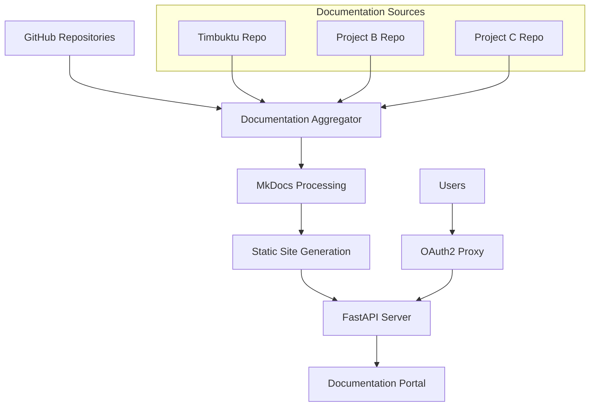
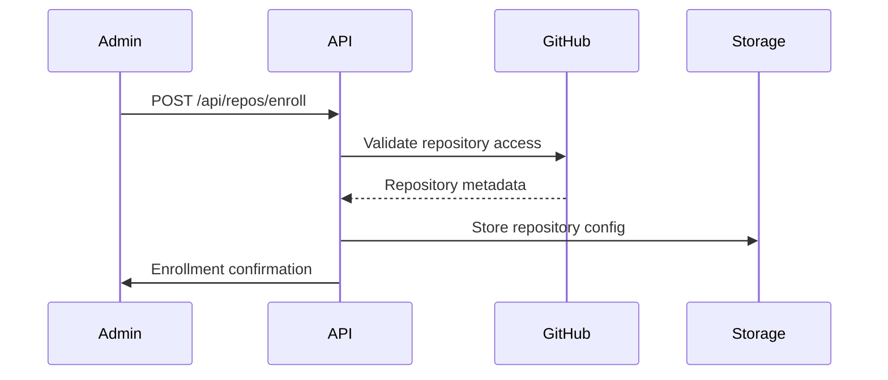
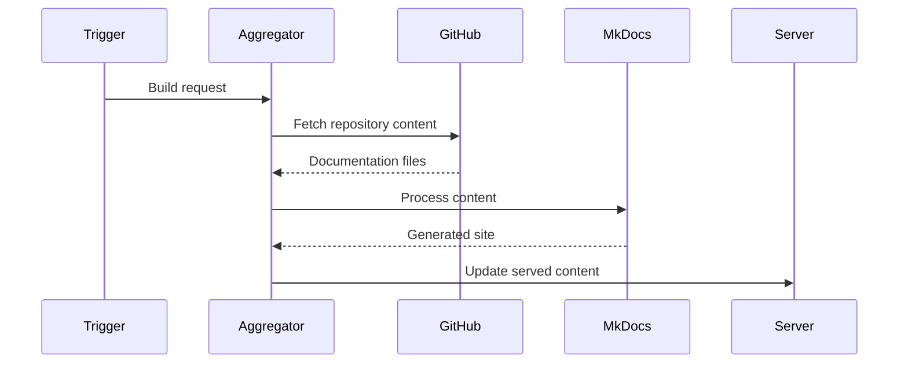
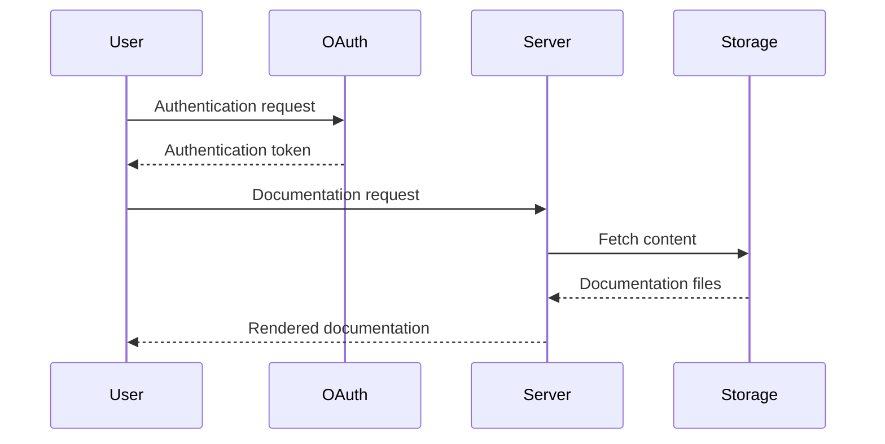

# Architecture Overview

This document provides a high-level overview of the FactFiber.ai
documentation infrastructure architecture.

## System Architecture

The FactFiber.ai documentation system is built as a centralized portal
that aggregates documentation from multiple repositories while providing a
unified experience.

## Core Components

### 1. Documentation Aggregator (`src/ff_docs/aggregator/`)

**Purpose**: Fetches and processes documentation from multiple repositories

**Key Features**:

- GitHub API integration for repository access
- Content caching and incremental updates
- Markdown processing and transformation
- Asset management (images, files, etc.)

**Classes**:

- `GitHubClient` - GitHub API wrapper
- `RepoManager` - Repository lifecycle management
- `ContentProcessor` - Markdown and asset processing

### 2. MkDocs Integration

**Purpose**: Processes aggregated content into a unified documentation site

**Configuration**:

- Multi-repository plugin for content aggregation
- Material theme with corporate branding
- Mathematical notation support (MathJax)
- Code syntax highlighting
- Search functionality

### 3. FastAPI Server (`src/ff_docs/server/`)

**Purpose**: Serves documentation and provides management APIs

**Endpoints**:

- `/docs/` - Documentation serving
- `/api/repos/` - Repository management
- `/api/health/` - Health checks and monitoring
- `/api/build/` - Documentation build triggers

**Features**:

- Hot-reloading for development
- Authentication integration
- Repository enrollment APIs
- Build status monitoring

### 4. Authentication System (`src/ff_docs/auth/`)

**Purpose**: Manages access control and user authentication

**Components**:

- GitHub OAuth integration
- Team-based access control
- Session management
- Security middleware

### 5. Configuration Management (`src/ff_docs/config/`)

**Purpose**: Centralized configuration and settings

**Settings Categories**:

- GitHub API configuration
- Authentication settings
- Server configuration
- MkDocs customization
- Logging and monitoring

## Data Flow

### 1. Repository Enrollment

### 2. Documentation Build Process

### 3. Content Serving

## Technology Stack

### Backend

- **Python 3.13** - Primary language
- **FastAPI** - Web framework
- **Poetry** - Dependency management
- **Pydantic** - Data validation and settings

### Documentation

- **MkDocs** - Static site generation
- **Material for MkDocs** - Theme and components
- **MathJax** - Mathematical notation
- **Mermaid** - Diagram rendering

### Infrastructure

- **Docker** - Containerization
- **Kubernetes** - Orchestration
- **DevSpace** - Development workflow
- **GitHub Actions** - CI/CD

### Authentication

- **OAuth2-Proxy** - Authentication proxy
- **GitHub OAuth** - Identity provider
- **JWT** - Token management

## Security Considerations

### Access Control

- Repository-level access control
- Team-based permissions
- Secure token storage
- Session management

### Data Protection

- HTTPS everywhere
- Secure headers
- Input validation
- Rate limiting

### Infrastructure Security

- Container security scanning
- Secrets management
- Network policies
- Security monitoring

## Scalability Design

### Horizontal Scaling

- Stateless server design
- Load balancer compatibility
- Distributed caching
- Database clustering

### Performance Optimization

- Content caching strategies
- Incremental builds
- CDN integration
- Asset optimization

### Monitoring

- Application metrics
- Performance monitoring
- Error tracking
- Usage analytics

## Development Workflow

### Local Development

1. **Environment Setup** - Poetry, pre-commit, Docker
2. **Repository Configuration** - Local repository paths
3. **Development Server** - Hot-reloading MkDocs + FastAPI
4. **Testing** - Unit, integration, and end-to-end tests

### Deployment Pipeline

1. **Code Quality** - Linting, type checking, testing
2. **Build Process** - Docker image creation
3. **Staging Deployment** - Kubernetes staging environment
4. **Production Deployment** - Blue-green deployment strategy

## Future Architecture Considerations

### Planned Enhancements

- **Multi-tenant Support** - Organization-level isolation
- **Advanced Search** - Elasticsearch integration
- **Real-time Updates** - WebSocket-based live updates
- **Analytics Dashboard** - Usage and performance metrics

### Scalability Roadmap

- **Microservices** - Service decomposition for large scale
- **Event-Driven Architecture** - Asynchronous processing
- **Global CDN** - Multi-region content distribution
- **Auto-scaling** - Dynamic resource allocation

---

*This architecture is designed to grow with FactFiber.ai's documentation
needs while maintaining simplicity and reliability.*
