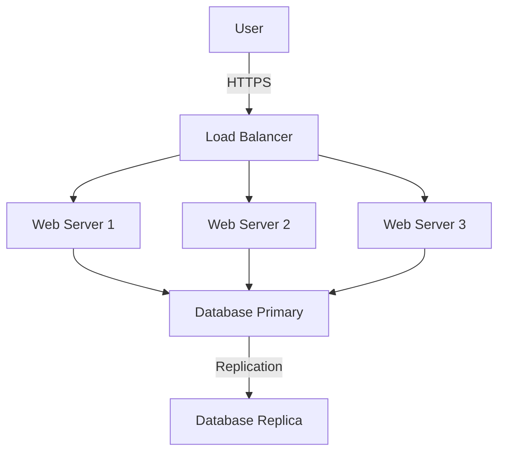

# Comprehensive Technical Implementation Guide for Centralized Multi-Repository Documentation with MkDocs

## Multi-repo MkDocs architecture patterns determine your documentation system's foundation

Setting up a centralized multi-repository documentation system requires choosing the right architecture pattern based on your organization's needs. **The mkdocs-multirepo-plugin emerges as the most flexible solution for true multi-repository setups**, while mkdocs-monorepo-plugin excels for monorepo architectures with multiple documentation sets.

This guide provides production-ready implementations for building a centralized documentation platform that aggregates content from multiple source repositories, with automated CI/CD pipelines, Kubernetes deployment, and advanced features like mathematical notation and interactive diagrams.

## GitHub OAuth/OIDC Authentication Integration Enhances Security

**GitHub provides excellent OpenID Connect capabilities that integrate seamlessly with your existing team structure.** With OAuth2-Proxy supporting GitHub organizations and teams, you can leverage your team's existing GitHub credentials while implementing fine-grained access control based on organization membership, team affiliations, and repository permissions.

**GitHub OAuth scopes enable precise permission control:**
- read:org scope allows checking organization and team membership
- Repository collaborator permissions can be verified for repo-specific documentation access
- X-Forwarded-Groups header provides org:team membership information

This authentication approach eliminates the need for separate documentation user management while maintaining enterprise-grade security through your existing GitHub permissions structure.

## Architecture patterns for multi-repository documentation

The choice between Git submodules, API aggregation, and plugin-based approaches fundamentally shapes your documentation infrastructure. Each pattern offers distinct advantages for different organizational structures.

### Git submodules approach provides version control integration

Git submodules maintain explicit version references to external repositories while keeping documentation centralized. This pattern works best for organizations with stable documentation that doesn't require real-time updates.

**Root repository structure:**
```yaml
# mkdocs.yml
site_name: "Company Documentation Portal"
site_url: https://docs.company.com

plugins:
  - search
  - awesome-pages

nav:
  - Home: index.md
  - Services:
    - API Service: submodules/api-service/docs/
    - Auth Service: submodules/auth-service/docs/
    - User Service: submodules/user-service/docs/

# Directory structure
.
├── mkdocs.yml
├── docs/
│   └── index.md
├── submodules/
│   ├── api-service/  # Git submodule
│   ├── auth-service/ # Git submodule
│   └── user-service/ # Git submodule
└── scripts/
    └── update-submodules.sh
```

**Automated submodule update script:**
```bash
#!/bin/bash
# scripts/update-submodules.sh

echo "Updating documentation submodules..."

# Initialize submodules if not already done
git submodule init
git submodule update --recursive

# Update each submodule to latest main branch
for submodule in $(git config --file .gitmodules --get-regexp path | awk '{ print $2 }'); do
    echo "Updating $submodule..."
    cd $submodule
    git checkout main
    git pull origin main
    cd - > /dev/null
done

git add .
git commit -m "Update documentation submodules"
```

### Plugin-based architecture enables dynamic content aggregation

The **mkdocs-multirepo-plugin** (v0.8.3, August 2024) provides the most flexible solution for aggregating documentation from multiple repositories without manual synchronization.

**Installation and configuration:**
```bash
pip install mkdocs-multirepo-plugin
```

```yaml
# mkdocs.yml
site_name: "Platform Documentation"
site_url: https://docs.company.com

plugins:
  - multirepo:
      cleanup: true
      keep_docs_dir: false
      nav_repos:
        - name: backend-api
          import_url: https://github.com/company/backend-api
          branch: main
          imports: [
            'docs/',
            'README.md',
            '/mkdocs.yml'
          ]
        - name: frontend-app
          import_url: https://github.com/company/frontend-app
          branch: main
          imports: [
            'documentation/',
            '*.md'
          ]

nav:
  - Home: index.md
  - Backend:
    - Overview: backend-api/README.md
    - API Reference: backend-api/docs/api.md
    - Authentication: backend-api/docs/auth.md
  - Frontend:
    - Getting Started: frontend-app/documentation/getting-started.md
    - Components: frontend-app/documentation/components.md
```

**Advanced multi-repo configuration with authentication:**
```yaml
plugins:
  - multirepo:
      cleanup: true
      repos:
        - section: "Backend Services"
          import_url: 'https://github.com/company/backend?edit_uri=/blob/main/'
          custom_name: backend
          config: 'documentation.yml'
        - section: "Frontend Application"
          import_url: 'https://github.com/company/frontend?branch=develop&docs_dir=docs/*'
          auth: token
          access_token: !ENV GITHUB_TOKEN
```

### Material for MkDocs projects plugin offers enterprise features

For Material for MkDocs Insiders subscribers, the built-in projects plugin provides advanced multi-project capabilities with superior performance.

```yaml
# mkdocs.yml
plugins:
  - projects:
      enabled: !ENV [CI, false]
      concurrency: 4
      projects_config_transform: !!python/name:projects.transform

# projects.py
def transform(project, config):
    """Transform project configuration during build"""
    project.config.use_directory_urls = config.use_directory_urls
    project.config.site_url = f"{config.site_url}/{project.name}/"
    
    # Inherit theme settings
    project.config.theme = config.theme
    project.config.markdown_extensions = config.markdown_extensions
    
    return project.config
```

### Integration with pdoc for automated API documentation

Combining handwritten documentation with auto-generated API references creates comprehensive technical documentation.

**MkDocs configuration for pdoc integration:**
```yaml
plugins:
  - mkdocstrings:
      handlers:
        python:
          paths: [src]
          options:
            docstring_style: google
            show_source: false
            show_root_heading: true
            merge_init_into_class: true

nav:
  - Home: index.md
  - User Guide: guide/
  - API Reference:
    - Overview: api/index.md
    - Core Module: api/core.md
    - Utils: api/utils.md
```

**API documentation template:**
```markdown
<!-- docs/api/core.md -->
# Core Module

::: mypackage.core
    options:
      show_source: false
      members:
        - CoreClass
        - process_data
        - validate_input
```

## GitHub Actions CI/CD workflows automate documentation builds

Automated workflows ensure documentation stays synchronized across repositories while maintaining build quality and security.

### Source repository workflow triggers central documentation updates

Each source repository needs a workflow that notifies the central documentation repository when changes occur.

```yaml
# .github/workflows/docs-update.yml
name: Trigger Documentation Update
on:
  push:
    branches: [main]
    paths:
      - 'docs/**'
      - '*.md'
      - 'src/**/*.py'  # For API documentation

jobs:
  trigger-central-docs:
    runs-on: ubuntu-latest
    steps:
      - name: Validate documentation
        uses: actions/checkout@v4
      
      - name: Setup Python
        uses: actions/setup-python@v5
        with:
          python-version: '3.11'
      
      - name: Test documentation build
        run: |
          pip install mkdocs mkdocs-material
          mkdocs build --strict
      
      - name: Trigger central documentation build
        uses: peter-evans/repository-dispatch@v3
        with:
          token: ${{ secrets.DOCS_PAT }}
          repository: company/central-docs
          event-type: source-updated
          client-payload: |
            {
              "repository": "${{ github.repository }}",
              "ref": "${{ github.ref }}",
              "sha": "${{ github.sha }}",
              "branch": "${{ github.ref_name }}",
              "docs_path": "docs/",
              "timestamp": "${{ github.event.head_commit.timestamp }}"
            }
```

### Central repository aggregates and deploys documentation

The central documentation repository orchestrates the aggregation and deployment process.

```yaml
# .github/workflows/aggregate-docs.yml
name: Aggregate and Deploy Documentation
on:
  repository_dispatch:
    types: [source-updated]
  workflow_dispatch:
    inputs:
      force_rebuild:
        description: 'Force rebuild all documentation'
        type: boolean
        default: false
  schedule:
    - cron: '0 */6 * * *'  # Every 6 hours

env:
  PYTHON_VERSION: '3.11'
  NODE_VERSION: '18'

jobs:
  collect-sources:
    runs-on: ubuntu-latest
    outputs:
      matrix: ${{ steps.set-matrix.outputs.matrix }}
    steps:
      - uses: actions/checkout@v4
      
      - name: Generate build matrix
        id: set-matrix
        run: |
          matrix=$(cat <<EOF
          {
            "include": [
              {"repo": "company/backend-api", "path": "docs/", "target": "backend/"},
              {"repo": "company/frontend-app", "path": "documentation/", "target": "frontend/"},
              {"repo": "company/mobile-sdk", "path": "docs/", "target": "mobile/"}
            ]
          }
          EOF
          )
          echo "matrix=$(echo $matrix | jq -c .)" >> $GITHUB_OUTPUT

  build-documentation:
    needs: collect-sources
    runs-on: ubuntu-latest
    strategy:
      matrix: ${{ fromJSON(needs.collect-sources.outputs.matrix) }}
      fail-fast: false
    
    steps:
      - name: Checkout central docs
        uses: actions/checkout@v4
        with:
          path: central-docs
      
      - name: Checkout source repository
        uses: actions/checkout@v4
        with:
          repository: ${{ matrix.repo }}
          token: ${{ secrets.DOCS_PAT }}
          path: source-repo
      
      - name: Copy documentation
        run: |
          mkdir -p central-docs/content/${{ matrix.target }}
          cp -r source-repo/${{ matrix.path }}* central-docs/content/${{ matrix.target }}/
      
      - name: Upload documentation segment
        uses: actions/upload-artifact@v4
        with:
          name: docs-${{ matrix.target }}
          path: central-docs/content/${{ matrix.target }}
          retention-days: 1

  deploy-documentation:
    needs: build-documentation
    runs-on: ubuntu-latest
    permissions:
      contents: read
      pages: write
      id-token: write
    
    steps:
      - uses: actions/checkout@v4
      
      - name: Download all documentation segments
        uses: actions/download-artifact@v4
        with:
          pattern: docs-*
          path: ./temp-content
          merge-multiple: true
      
      - name: Setup Python
        uses: actions/setup-python@v5
        with:
          python-version: ${{ env.PYTHON_VERSION }}
          cache: 'pip'
      
      - name: Install dependencies
        run: |
          pip install -r requirements.txt
          pip install mkdocs-multirepo-plugin
      
      - name: Build unified documentation
        run: |
          export ENABLE_MKDOCS_PLUGINS=true
          mkdocs build --strict
      
      - name: Upload to GitHub Pages
        uses: actions/upload-pages-artifact@v3
        with:
          path: ./site
      
      - name: Deploy to GitHub Pages
        uses: actions/deploy-pages@v4
```

### Security best practices protect cross-repository workflows

Implementing secure authentication and least-privilege access ensures documentation workflows don't compromise repository security.

**GitHub App authentication (recommended):**
```yaml
- name: Generate GitHub App Token
  id: app-token
  uses: tibdex/github-app-token@v2
  with:
    app_id: ${{ secrets.APP_ID }}
    private_key: ${{ secrets.APP_PRIVATE_KEY }}
    installation_id: ${{ secrets.INSTALLATION_ID }}

- name: Use App token for checkout
  uses: actions/checkout@v4
  with:
    repository: company/other-repo
    token: ${{ steps.app-token.outputs.token }}
```

**OIDC authentication for cloud deployments:**
```yaml
permissions:
  id-token: write
  contents: read

steps:
  - name: Configure AWS credentials
    uses: aws-actions/configure-aws-credentials@v4
    with:
      role-to-assume: arn:aws:iam::123456789012:role/GitHubActionsRole
      aws-region: us-east-1

  - name: Deploy to S3
    run: |
      aws s3 sync ./site/ s3://docs-bucket/ --delete
      aws cloudfront create-invalidation \
        --distribution-id ${{ secrets.CLOUDFRONT_DISTRIBUTION_ID }} \
        --paths "/*"
```

### Reusable workflows simplify documentation management

Creating reusable workflows reduces duplication and ensures consistency across repositories.

```yaml
# .github/workflows/reusable-docs-build.yml
name: Reusable Documentation Build
on:
  workflow_call:
    inputs:
      docs_path:
        required: true
        type: string
      python_version:
        required: false
        type: string
        default: '3.11'
    outputs:
      artifact_name:
        description: "Name of the uploaded artifact"
        value: ${{ jobs.build.outputs.artifact_name }}

jobs:
  build:
    runs-on: ubuntu-latest
    outputs:
      artifact_name: ${{ steps.upload.outputs.artifact_name }}
    
    steps:
      - uses: actions/checkout@v4
      
      - name: Setup Python
        uses: actions/setup-python@v5
        with:
          python-version: ${{ inputs.python_version }}
          cache: 'pip'
      
      - name: Cache MkDocs build
        uses: actions/cache@v4
        with:
          path: |
            .cache
            site/
          key: mkdocs-${{ runner.os }}-${{ hashFiles('**/mkdocs.yml', '**/requirements.txt') }}
      
      - name: Install dependencies
        run: |
          pip install mkdocs-material mkdocs-minify-plugin
          [ -f requirements.txt ] && pip install -r requirements.txt
      
      - name: Build documentation
        run: |
          cd ${{ inputs.docs_path }}
          mkdocs build --strict
      
      - name: Upload artifact
        id: upload
        uses: actions/upload-artifact@v4
        with:
          name: docs-${{ github.sha }}
          path: ${{ inputs.docs_path }}/site/
```

## GitHub OAuth2-Proxy Authentication secures documentation access

OAuth2-Proxy provides enterprise-grade authentication using your team's existing GitHub credentials. The integration supports organization-level, team-level, and repository-level access control, making it perfect for documentation systems with varying permission requirements.

### OAuth2-Proxy configuration leverages GitHub team structure

OAuth2-Proxy's GitHub provider offers sophisticated access control options that map perfectly to your organization's structure.

```yaml
# oauth2-proxy-config.yaml
config:
  clientID: "your-github-oauth-app-client-id"
  clientSecret: "your-github-oauth-app-client-secret"
  cookieSecret: "randomly-generated-cookie-secret"
  
  # Email domain restrictions (use * for GitHub-based auth)
  emailDomains:
    - "*"
  
  # GitHub-specific configuration
  github:
    org: "your-org-name"  # Restrict to organization members
    team: "docs-team,platform-team"  # Comma-separated team list
    
  # Advanced GitHub permissions
  provider: github
  scope: "user:email read:org"
  
  # Upstream configuration for documentation service
  upstreams:
    - "http://mkdocs-service:8000"
  
  # Cookie configuration for security
  cookieSecure: true
  cookieSameSite: lax
  cookieExpire: "24h"
  cookieRefresh: "1h"
  
  # Headers to pass through (includes team membership)
  setXAuthRequest: true
  passAuthorizationHeader: true
  passBasicAuth: false
  passAccessToken: true
  
  # Session validation
  sessionStoreType: redis
  redisConnectionURL: "redis://redis-service:6379"
```

### OAuth application registration enables GitHub integration

Setting up GitHub OAuth requires registering an application with appropriate permissions and callback URLs.

**GitHub OAuth App configuration:**
1. Navigate to GitHub → Settings → Developer settings → OAuth Apps
2. Click "New OAuth App"
3. Configure application:
   - Application name: "Company Documentation Portal"
   - Homepage URL: https://docs.company.com
   - Authorization callback URL: https://docs.company.com/oauth2/callback
4. Note Client ID and generate Client Secret

**Required OAuth scopes for documentation access:**
```yaml
# Minimal scopes for basic authentication
scopes:
  - user:email        # User identification
  - read:org         # Organization/team membership

# Extended scopes for repository-level permissions
scopes:
  - user:email
  - read:org
  - repo:status      # Repository access validation (without code access)
```

### Kubernetes deployment with fine-grained permissions

OAuth2-Proxy deployment in Kubernetes provides centralized authentication for all documentation services.

```yaml
# oauth2-proxy-deployment.yaml
apiVersion: apps/v1
kind: Deployment
metadata:
  name: oauth2-proxy
  namespace: docs
spec:
  replicas: 2
  selector:
    matchLabels:
      app: oauth2-proxy
  template:
    metadata:
      labels:
        app: oauth2-proxy
    spec:
      containers:
      - name: oauth2-proxy
        image: quay.io/oauth2-proxy/oauth2-proxy:v7.6.0
        args:
          - --provider=github
          - --email-domain=*
          - --github-org=your-org-name
          - --github-team=docs-team,platform-team
          - --upstream=http://mkdocs-service:8000
          - --http-address=0.0.0.0:4180
          - --redirect-url=https://docs.company.com/oauth2/callback
          - --cookie-secure=true
          - --cookie-httponly=true
          - --cookie-samesite=lax
          - --cookie-expire=24h
          - --cookie-refresh=1h
          - --cookie-name=_oauth2_proxy
          - --set-xauthrequest=true
          - --pass-authorization-header=true
          - --pass-access-token=true
          - --session-store-type=redis
          - --redis-connection-url=redis://redis-service:6379
        env:
        - name: OAUTH2_PROXY_CLIENT_ID
          valueFrom:
            secretKeyRef:
              name: oauth2-proxy-secrets
              key: client-id
        - name: OAUTH2_PROXY_CLIENT_SECRET
          valueFrom:
            secretKeyRef:
              name: oauth2-proxy-secrets
              key: client-secret
        - name: OAUTH2_PROXY_COOKIE_SECRET
          valueFrom:
            secretKeyRef:
              name: oauth2-proxy-secrets
              key: cookie-secret
        ports:
        - containerPort: 4180
          name: http
        livenessProbe:
          httpGet:
            path: /ping
            port: http
          initialDelaySeconds: 10
          periodSeconds: 30
        readinessProbe:
          httpGet:
            path: /ping
            port: http
          initialDelaySeconds: 5
          periodSeconds: 10
        resources:
          requests:
            cpu: 100m
            memory: 128Mi
          limits:
            cpu: 500m
            memory: 256Mi
        securityContext:
          runAsNonRoot: true
          runAsUser: 65532
          readOnlyRootFilesystem: true
          allowPrivilegeEscalation: false
          capabilities:
            drop:
            - ALL

---
apiVersion: v1
kind: Service
metadata:
  name: oauth2-proxy
  namespace: docs
spec:
  selector:
    app: oauth2-proxy
  ports:
  - port: 4180
    targetPort: http
    name: http
  type: ClusterIP

---
apiVersion: v1
kind: Secret
metadata:
  name: oauth2-proxy-secrets
  namespace: docs
type: Opaque
data:
  client-id: <base64-encoded-github-client-id>
  client-secret: <base64-encoded-github-client-secret>
  cookie-secret: <base64-encoded-random-cookie-secret>
```

### DevSpace configuration includes OAuth2-Proxy integration

DevSpace configuration can deploy both documentation services and authentication proxy together.

```yaml
# devspace.yaml (updated with OAuth2-Proxy)
version: v2beta1
name: mkdocs-platform

images:
  mkdocs:
    image: registry.company.com/mkdocs
    dockerfile: ./Dockerfile
  oauth2-proxy:
    image: quay.io/oauth2-proxy/oauth2-proxy:v7.6.0

deployments:
  oauth2-proxy:
    helm:
      chart:
        name: oauth2-proxy
        repo: https://oauth2-proxy.github.io/manifests
        version: "^7.7.0"
      values:
        image:
          repository: quay.io/oauth2-proxy/oauth2-proxy
          tag: v7.6.0
        config:
          clientID: ${GITHUB_CLIENT_ID}
          clientSecret: ${GITHUB_CLIENT_SECRET}
          cookieSecret: ${OAUTH2_PROXY_COOKIE_SECRET}
          configFile: |-
            provider = "github"
            email_domains = ["*"]
            github_org = "${GITHUB_ORG}"
            github_team = "${GITHUB_TEAMS}"
            upstreams = ["http://mkdocs-service:8000"]
            cookie_secure = true
            cookie_httponly = true
            cookie_samesite = "lax"
            cookie_expire = "24h"
            cookie_refresh = "1h"
            set_xauthrequest = true
            pass_authorization_header = true
            pass_access_token = true
        redis:
          enabled: true
        replicaCount: 2
        
  mkdocs:
    helm:
      chart:
        name: ./helm-chart
      values:
        image: ${DEVSPACE_IMAGE_mkdocs}
        replicaCount: 2
        service:
          type: ClusterIP
          port: 8000
        ingress:
          enabled: true
          className: nginx
          annotations:
            nginx.ingress.kubernetes.io/auth-url: "https://$host/oauth2/auth"
            nginx.ingress.kubernetes.io/auth-signin: "https://$host/oauth2/start?rd=$escaped_request_uri"
            nginx.ingress.kubernetes.io/auth-response-headers: "X-Auth-Request-User,X-Auth-Request-Email,X-Forwarded-Groups"
          host: docs.company.com
          tls:
            enabled: true
            secretName: docs-tls

variables:
  GITHUB_CLIENT_ID:
    source: env
    default: ""
  GITHUB_CLIENT_SECRET:
    source: env
    default: ""
  OAUTH2_PROXY_COOKIE_SECRET:
    source: env
    default: ""
  GITHUB_ORG:
    source: env
    default: "your-org-name"
  GITHUB_TEAMS:
    source: env
    default: "docs-team,platform-team"
```

### Scope-based access control enables granular permissions

OAuth2-Proxy's X-Forwarded-Groups header provides team membership information that can be used for fine-grained access control within your documentation system.

**Ingress configuration with authentication:**
```yaml
apiVersion: networking.k8s.io/v1
kind: Ingress
metadata:
  name: mkdocs-ingress
  namespace: docs
  annotations:
    nginx.ingress.kubernetes.io/auth-url: "https://$host/oauth2/auth"
    nginx.ingress.kubernetes.io/auth-signin: "https://$host/oauth2/start?rd=$escaped_request_uri"
    nginx.ingress.kubernetes.io/auth-response-headers: |
      X-Auth-Request-User,X-Auth-Request-Email,X-Forwarded-Groups,X-Auth-Request-Access-Token
    # Optional: Configure auth caching to improve performance
    nginx.ingress.kubernetes.io/auth-cache-key: "$remote_user$http_authorization"
    nginx.ingress.kubernetes.io/auth-cache-duration: "200 202 401 5m"
spec:
  ingressClassName: nginx
  tls:
  - hosts:
    - docs.company.com
    secretName: docs-tls
  rules:
  - host: docs.company.com
    http:
      paths:
      - path: /oauth2
        pathType: Prefix
        backend:
          service:
            name: oauth2-proxy
            port:
              number: 4180
      - path: /
        pathType: Prefix
        backend:
          service:
            name: mkdocs-service
            port:
              number: 8000

---
# Separate ingresses for different documentation sections with different team requirements
apiVersion: networking.k8s.io/v1
kind: Ingress
metadata:
  name: admin-docs-ingress
  namespace: docs
  annotations:
    nginx.ingress.kubernetes.io/auth-url: "https://$host/oauth2/auth"
    nginx.ingress.kubernetes.io/auth-signin: "https://$host/oauth2/start?rd=$escaped_request_uri"
    nginx.ingress.kubernetes.io/auth-response-headers: "X-Auth-Request-User,X-Auth-Request-Email,X-Forwarded-Groups"
    # Lua script to check for admin team membership
    nginx.ingress.kubernetes.io/auth-snippet: |
      if ngx.var.http_x_forwarded_groups and not string.match(ngx.var.http_x_forwarded_groups, "your%-org%-name:admin%-team") then
        ngx.status = 403
        ngx.say("Access denied: Admin team membership required")
        ngx.exit(403)
      end
spec:
  ingressClassName: nginx
  rules:
  - host: docs.company.com
    http:
      paths:
      - path: /admin
        pathType: Prefix
        backend:
          service:
            name: admin-docs-service
            port:
              number: 8000
```

**Custom middleware for advanced access control:**
```javascript
// docs-auth-middleware.js
const express = require('express');
const app = express();

// Middleware to parse GitHub team memberships
function parseGitHubTeams(req, res, next) {
  const forwardedGroups = req.headers['x-forwarded-groups'];
  if (forwardedGroups) {
    // Format: org1:team1,org1:team2,org2:team1
    req.githubTeams = forwardedGroups.split(',').map(group => {
      const [org, team] = group.split(':');
      return { org, team };
    });
  } else {
    req.githubTeams = [];
  }
  next();
}

// Repository-specific access control
function requireRepoAccess(repoName) {
  return async (req, res, next) => {
    const userToken = req.headers['x-auth-request-access-token'];
    const user = req.headers['x-auth-request-user'];
    
    if (!userToken) {
      return res.status(401).json({ error: 'Authentication required' });
    }
    
    try {
      // Check repository collaborator status
      const response = await fetch(
        `https://api.github.com/repos/${process.env.GITHUB_ORG}/${repoName}/collaborators/${user}`,
        {
          headers: {
            'Authorization': `Bearer ${userToken}`,
            'Accept': 'application/vnd.github+json',
            'X-GitHub-Api-Version': '2022-11-28'
          }
        }
      );
      
      if (response.status === 204) {
        // User is a collaborator
        next();
      } else if (response.status === 404) {
        res.status(403).json({ 
          error: `Access denied: ${repoName} repository access required` 
        });
      } else {
        throw new Error(`GitHub API error: ${response.status}`);
      }
    } catch (error) {
      console.error('Repository access check failed:', error);
      res.status(500).json({ error: 'Access validation failed' });
    }
  };
}

// Team-specific access control
function requireTeamMembership(requiredTeams) {
  return (req, res, next) => {
    const userTeams = req.githubTeams.map(t => t.team);
    const hasRequiredTeam = requiredTeams.some(team => userTeams.includes(team));
    
    if (hasRequiredTeam) {
      next();
    } else {
      res.status(403).json({ 
        error: `Access denied: Membership in one of [${requiredTeams.join(', ')}] required`,
        userTeams 
      });
    }
  };
}

// Apply middleware
app.use(parseGitHubTeams);

// Route examples
app.get('/api/docs/public/*', (req, res) => {
  // Public documentation - no additional restrictions
  res.json({ access: 'granted', level: 'public' });
});

app.get('/api/docs/backend/*', 
  requireTeamMembership(['backend-team', 'platform-team']),
  (req, res) => {
    res.json({ access: 'granted', level: 'backend' });
  }
);

app.get('/api/docs/admin/*', 
  requireTeamMembership(['admin-team']),
  (req, res) => {
    res.json({ access: 'granted', level: 'admin' });
  }
);

app.get('/api/docs/repo/:repo/*', 
  requireRepoAccess(req.params.repo),
  (req, res) => {
    res.json({ access: 'granted', level: 'repository', repo: req.params.repo });
  }
);

app.listen(3000, () => {
  console.log('Documentation auth middleware running on port 3000');
});
```

### GitHub API integration validates permissions

For advanced access control scenarios, you can validate specific GitHub permissions using the API with minimal scopes.

```python
# github-permissions-validator.py
import os
import requests
from typing import List, Dict, Optional
from functools import lru_cache

class GitHubPermissionValidator:
    def __init__(self, org_name: str):
        self.org_name = org_name
        self.base_url = "https://api.github.com"
    
    @lru_cache(maxsize=128)
    def get_user_teams(self, username: str, access_token: str) -> List[str]:
        """Get list of teams user belongs to within the organization."""
        headers = {
            'Authorization': f'Bearer {access_token}',
            'Accept': 'application/vnd.github+json',
            'X-GitHub-Api-Version': '2022-11-28'
        }
        
        try:
            # Get user's teams in the organization
            response = requests.get(
                f"{self.base_url}/orgs/{self.org_name}/teams",
                headers=headers
            )
            response.raise_for_status()
            
            teams = []
            for team in response.json():
                # Check if user is a member of this team
                member_response = requests.get(
                    f"{self.base_url}/teams/{team['id']}/memberships/{username}",
                    headers=headers
                )
                if member_response.status_code == 200:
                    membership = member_response.json()
                    if membership.get('state') == 'active':
                        teams.append(team['slug'])
            
            return teams
        except requests.RequestException as e:
            print(f"Error fetching user teams: {e}")
            return []
    
    @lru_cache(maxsize=128)
    def check_repo_collaborator(self, username: str, repo_name: str, access_token: str) -> Dict:
        """Check if user is a collaborator on a specific repository."""
        headers = {
            'Authorization': f'Bearer {access_token}',
            'Accept': 'application/vnd.github+json',
            'X-GitHub-Api-Version': '2022-11-28'
        }
        
        try:
            response = requests.get(
                f"{self.base_url}/repos/{self.org_name}/{repo_name}/collaborators/{username}/permission",
                headers=headers
            )
            
            if response.status_code == 200:
                permission_data = response.json()
                return {
                    'has_access': True,
                    'permission': permission_data.get('permission', 'none'),
                    'role_name': permission_data.get('role_name', 'unknown')
                }
            else:
                return {'has_access': False, 'permission': 'none'}
                
        except requests.RequestException as e:
            print(f"Error checking repository permissions: {e}")
            return {'has_access': False, 'permission': 'none'}
    
    def validate_documentation_access(self, username: str, access_token: str, 
                                    requested_path: str) -> Dict:
        """Validate if user should have access to specific documentation path."""
        
        # Define access rules based on path patterns
        access_rules = {
            '/admin/': {'required_teams': ['admin-team']},
            '/backend/': {'required_teams': ['backend-team', 'platform-team']},
            '/mobile/': {'required_teams': ['mobile-team', 'platform-team']},
            '/repo/': {'repository_access': True}  # Requires repo collaborator access
        }
        
        user_teams = self.get_user_teams(username, access_token)
        
        for path_pattern, rules in access_rules.items():
            if requested_path.startswith(path_pattern):
                # Check team-based access
                if 'required_teams' in rules:
                    required_teams = rules['required_teams']
                    if any(team in user_teams for team in required_teams):
                        return {
                            'access_granted': True,
                            'reason': f'Team membership: {user_teams}',
                            'level': 'team-based'
                        }
                
                # Check repository-based access
                if 'repository_access' in rules and requested_path.startswith('/repo/'):
                    # Extract repo name from path: /repo/backend-api/docs/...
                    path_parts = requested_path.strip('/').split('/')
                    if len(path_parts) >= 2:
                        repo_name = path_parts[1]
                        repo_access = self.check_repo_collaborator(username, repo_name, access_token)
                        if repo_access['has_access']:
                            return {
                                'access_granted': True,
                                'reason': f'Repository collaborator: {repo_access["permission"]}',
                                'level': 'repository-based'
                            }
        
        # Default: allow access to public documentation
        if not any(requested_path.startswith(pattern) for pattern in access_rules.keys()):
            return {
                'access_granted': True,
                'reason': 'Public documentation',
                'level': 'public'
            }
        
        return {
            'access_granted': False,
            'reason': 'Insufficient permissions',
            'user_teams': user_teams
        }

# Flask integration example
from flask import Flask, request, jsonify

app = Flask(__name__)
validator = GitHubPermissionValidator(os.getenv('GITHUB_ORG', 'your-org-name'))

@app.before_request
def validate_access():
    # Skip validation for OAuth2-Proxy endpoints
    if request.path.startswith('/oauth2/'):
        return
    
    # Extract user information from OAuth2-Proxy headers
    username = request.headers.get('X-Auth-Request-User')
    access_token = request.headers.get('X-Auth-Request-Access-Token')
    
    if not username or not access_token:
        return jsonify({'error': 'Authentication required'}), 401
    
    # Validate access for the requested path
    access_result = validator.validate_documentation_access(
        username, access_token, request.path
    )
    
    if not access_result['access_granted']:
        return jsonify({
            'error': 'Access denied',
            'reason': access_result['reason'],
            'user_teams': access_result.get('user_teams', [])
        }), 403
    
    # Store access information for logging/analytics
    request.access_info = access_result

if __name__ == '__main__':
    app.run(host='0.0.0.0', port=5000)
```

### Session management with Redis ensures scalability

For production deployments, Redis-based session storage provides horizontal scalability and session persistence.

```yaml
# redis-deployment.yaml
apiVersion: apps/v1
kind: Deployment
metadata:
  name: redis
  namespace: docs
spec:
  replicas: 1
  selector:
    matchLabels:
      app: redis
  template:
    metadata:
      labels:
        app: redis
    spec:
      containers:
      - name: redis
        image: redis:7-alpine
        args:
          - redis-server
          - --save
          - "900 1"
          - --save
          - "300 10"
          - --save
          - "60 10000"
          - --requirepass
          - "$(REDIS_PASSWORD)"
        env:
        - name: REDIS_PASSWORD
          valueFrom:
            secretKeyRef:
              name: redis-secret
              key: password
        ports:
        - containerPort: 6379
          name: redis
        volumeMounts:
        - name: redis-data
          mountPath: /data
        resources:
          requests:
            cpu: 100m
            memory: 128Mi
          limits:
            cpu: 500m
            memory: 512Mi
      volumes:
      - name: redis-data
        persistentVolumeClaim:
          claimName: redis-pvc

---
apiVersion: v1
kind: Service
metadata:
  name: redis-service
  namespace: docs
spec:
  selector:
    app: redis
  ports:
  - port: 6379
    targetPort: redis
  type: ClusterIP

---
apiVersion: v1
kind: PersistentVolumeClaim
metadata:
  name: redis-pvc
  namespace: docs
spec:
  accessModes:
    - ReadWriteOnce
  resources:
    requests:
      storage: 1Gi
```

## Kubernetes deployment with DevSpace accelerates development

DevSpace provides superior developer experience for Kubernetes deployments compared to traditional approaches, with hot-reloading and intelligent synchronization.

### DevSpace configuration optimizes documentation serving

The DevSpace configuration defines both development and production environments with automatic synchronization and build hooks.

```yaml
# devspace.yaml
version: v2beta1
name: mkdocs-platform

images:
  mkdocs:
    image: registry.company.com/mkdocs
    dockerfile: ./Dockerfile
    build:
      docker:
        options:
          buildArgs:
            MKDOCS_VERSION: "9.5.3"
            MATERIAL_VERSION: "9.5.3"

deployments:
  mkdocs:
    helm:
      chart:
        name: ./helm-chart
      values:
        image: ${DEVSPACE_IMAGE_mkdocs}
        replicas: 1
        service:
          type: ClusterIP
          port: 8000
        ingress:
          enabled: true
          className: nginx
          host: docs.company.com
          tls:
            enabled: true
            secretName: docs-tls
        resources:
          requests:
            cpu: "100m"
            memory: "256Mi"
          limits:
            cpu: "1000m"
            memory: "1Gi"

dev:
  mkdocs:
    imageSelector: ${DEVSPACE_IMAGE_mkdocs}
    sync:
      - localSubPath: ./docs
        containerPath: /app/docs
        excludePaths:
          - .git/
          - __pycache__/
          - site/
        onUpload:
          execRemote:
            onBatch:
              command: mkdocs build
      - localSubPath: ./mkdocs.yml
        containerPath: /app/mkdocs.yml
        onUpload:
          execRemote:
            onBatch:
              command: mkdocs build
    terminal:
      command: ["sh"]
    ports:
      - port: "8000:8000"
    open:
      - url: http://localhost:8000

profiles:
  - name: production
    activation:
      - vars:
          DEVSPACE_ENV: production
    patches:
      - op: replace
        path: deployments.mkdocs.helm.values.replicas
        value: 3
      - op: add
        path: deployments.mkdocs.helm.values.affinity
        value:
          podAntiAffinity:
            preferredDuringSchedulingIgnoredDuringExecution:
            - weight: 100
              podAffinityTerm:
                labelSelector:
                  matchLabels:
                    app: mkdocs
                topologyKey: kubernetes.io/hostname

hooks:
  - events: ["before:build"]
    command: |
      echo "Validating documentation..."
      mkdocs build --strict --quiet
  - events: ["after:deploy"]
    command: |
      echo "Documentation deployed!"
      kubectl rollout status deployment/mkdocs -n ${DEVSPACE_NAMESPACE}

commands:
  logs:
    command: kubectl logs -f deployment/mkdocs -n ${DEVSPACE_NAMESPACE}
  shell:
    command: devspace enter --image-selector ${DEVSPACE_IMAGE_mkdocs}
  test:
    command: |
      echo "Running documentation tests..."
      pytest tests/
```

### Dockerfile optimizes for documentation serving

A multi-stage Dockerfile reduces image size while including all necessary dependencies.

```dockerfile
# Dockerfile
FROM python:3.11-slim as builder

WORKDIR /build
COPY requirements.txt .
RUN pip install --no-cache-dir --user -r requirements.txt

FROM python:3.11-slim

# Install system dependencies
RUN apt-get update && apt-get install -y \
    git \
    && rm -rf /var/lib/apt/lists/*

# Copy Python packages from builder
COPY --from=builder /root/.local /root/.local
ENV PATH=/root/.local/bin:$PATH

WORKDIR /app

# Copy documentation files
COPY mkdocs.yml .
COPY docs/ docs/
COPY overrides/ overrides/

# Build documentation
RUN mkdocs build

# Expose port
EXPOSE 8000

# Health check
HEALTHCHECK --interval=30s --timeout=3s --start-period=5s --retries=3 \
  CMD curl -f http://localhost:8000/ || exit 1

# Run MkDocs server
CMD ["mkdocs", "serve", "--dev-addr=0.0.0.0:8000"]
```

### Alternative deployment tools comparison reveals trade-offs

Each Kubernetes deployment tool offers unique advantages for documentation serving.

**Skaffold provides CI/CD pipeline integration:**
```yaml
# skaffold.yaml
apiVersion: skaffold/v4beta8
kind: Config
metadata:
  name: mkdocs-docs
build:
  artifacts:
    - image: mkdocs-docs
      docker:
        dockerfile: Dockerfile
  tagPolicy:
    sha256: {}
deploy:
  helm:
    releases:
      - name: mkdocs
        chartPath: ./helm-chart
        valuesFiles:
          - values.yaml
        setValues:
          image.tag: "{{.IMAGE_TAG}}"
portForward:
  - resourceType: service
    resourceName: mkdocs
    port: 8000
    localPort: 8000
profiles:
  - name: dev
    activation:
      - command: dev
    build:
      artifacts:
        - image: mkdocs-docs
          sync:
            manual:
              - src: "docs/**/*.md"
                dest: /app/docs
              - src: "mkdocs.yml"
                dest: /app
```

**Tilt excels at local development with fast hot-reloading:**
```python
# Tiltfile
docker_build(
  'mkdocs-docs',
  '.',
  dockerfile='Dockerfile',
  live_update=[
    sync('./docs', '/app/docs'),
    sync('./mkdocs.yml', '/app/mkdocs.yml'),
    run('cd /app && mkdocs build', trigger=['./docs', './mkdocs.yml'])
  ]
)

k8s_yaml('k8s/deployment.yaml')
k8s_yaml('k8s/service.yaml')
k8s_yaml('k8s/ingress.yaml')

k8s_resource('mkdocs', port_forwards='8000:8000')

# Add custom buttons to Tilt UI
local_resource(
  'documentation-tests',
  'pytest tests/',
  deps=['./tests'],
  labels=['tests']
)
```

**Comparison of deployment tools:**

| Feature | DevSpace | Skaffold | Tilt | Garden.io | Helm |
|---------|----------|----------|------|-----------|------|
| Hot-reloading speed | Fast | Medium | Very Fast | Medium | N/A |
| Learning curve | Medium | Easy | Easy | Steep | Medium |
| Multi-service support | Excellent | Good | Excellent | Excellent | Good |
| Production readiness | High | High | Medium | High | Very High |
| Developer experience | Excellent | Good | Excellent | Good | Fair |
| CI/CD integration | Good | Excellent | Fair | Good | Excellent |

### Kubernetes manifests ensure production reliability

Production deployments require comprehensive Kubernetes configurations for reliability and scalability.

**Deployment with rolling updates:**
```yaml
apiVersion: apps/v1
kind: Deployment
metadata:
  name: mkdocs
  labels:
    app: mkdocs
spec:
  replicas: 3
  strategy:
    type: RollingUpdate
    rollingUpdate:
      maxSurge: 1
      maxUnavailable: 0
  selector:
    matchLabels:
      app: mkdocs
  template:
    metadata:
      labels:
        app: mkdocs
    spec:
      affinity:
        podAntiAffinity:
          preferredDuringSchedulingIgnoredDuringExecution:
          - weight: 100
            podAffinityTerm:
              labelSelector:
                matchLabels:
                  app: mkdocs
              topologyKey: topology.kubernetes.io/zone
      containers:
      - name: mkdocs
        image: registry.company.com/mkdocs:latest
        ports:
        - containerPort: 8000
          name: http
        env:
        - name: MKDOCS_ENV
          value: "production"
        resources:
          requests:
            cpu: 200m
            memory: 256Mi
          limits:
            cpu: 1000m
            memory: 1Gi
        livenessProbe:
          httpGet:
            path: /
            port: http
          initialDelaySeconds: 10
          periodSeconds: 30
        readinessProbe:
          httpGet:
            path: /
            port: http
          initialDelaySeconds: 5
          periodSeconds: 10
        volumeMounts:
        - name: config
          mountPath: /app/mkdocs.yml
          subPath: mkdocs.yml
        - name: content
          mountPath: /app/docs
      volumes:
      - name: config
        configMap:
          name: mkdocs-config
      - name: content
        persistentVolumeClaim:
          claimName: mkdocs-content
```

**Horizontal Pod Autoscaler for dynamic scaling:**
```yaml
apiVersion: autoscaling/v2
kind: HorizontalPodAutoscaler
metadata:
  name: mkdocs-hpa
spec:
  scaleTargetRef:
    apiVersion: apps/v1
    kind: Deployment
    name: mkdocs
  minReplicas: 2
  maxReplicas: 10
  metrics:
  - type: Resource
    resource:
      name: cpu
      target:
        type: Utilization
        averageUtilization: 70
  - type: Resource
    resource:
      name: memory
      target:
        type: Utilization
        averageUtilization: 80
  behavior:
    scaleDown:
      stabilizationWindowSeconds: 300
      policies:
      - type: Percent
        value: 10
        periodSeconds: 60
    scaleUp:
      stabilizationWindowSeconds: 60
      policies:
      - type: Percent
        value: 50
        periodSeconds: 60
```

## Repository enrollment automation streamlines onboarding

Automated enrollment processes ensure consistent documentation standards across all repositories.

### Enrollment script automates repository addition

A comprehensive enrollment script handles all aspects of adding new repositories to the documentation system.

```bash
#!/bin/bash
# enroll-repository.sh

set -euo pipefail

# Configuration
CENTRAL_REPO="https://github.com/company/central-docs.git"
TEMPLATES_DIR="./templates"

# Parse arguments
REPO_URL=$1
REPO_NAME=${2:-$(basename "$REPO_URL" .git)}
SECTION_NAME=${3:-$REPO_NAME}
BRANCH=${4:-main}

echo "Enrolling repository: $REPO_NAME"

# Clone central documentation repository
TEMP_DIR=$(mktemp -d)
git clone "$CENTRAL_REPO" "$TEMP_DIR/central-docs"
cd "$TEMP_DIR/central-docs"

# Add repository to mkdocs.yml using yq
yq eval '.plugins.multirepo.nav_repos += [{
  "name": "'$REPO_NAME'",
  "import_url": "'$REPO_URL'",
  "branch": "'$BRANCH'",
  "imports": ["docs/**", "README.md", "mkdocs.yml"]
}]' -i mkdocs.yml

# Update navigation
yq eval '.nav += [{
  "'$SECTION_NAME'": [
    {"Overview": "'$REPO_NAME'/README.md"},
    {"Documentation": "'$REPO_NAME'/docs/"}
  ]
}]' -i mkdocs.yml

# Create PR for the changes
git checkout -b "enroll-$REPO_NAME"
git add mkdocs.yml
git commit -m "Add $REPO_NAME to documentation portal"
git push origin "enroll-$REPO_NAME"

# Create GitHub PR using gh CLI
gh pr create \
  --title "Add $REPO_NAME to documentation portal" \
  --body "This PR adds $REPO_NAME documentation to the central portal." \
  --base main

echo "Repository enrolled successfully. PR created for review."

# Cleanup
cd -
rm -rf "$TEMP_DIR"
```

### Documentation templates ensure consistency

Standardized templates maintain documentation quality across all repositories.

```yaml
# templates/mkdocs-base.yml
site_name: ${PROJECT_NAME}
site_description: ${PROJECT_DESCRIPTION}
site_url: https://docs.company.com/${PROJECT_SLUG}/
repo_url: ${REPO_URL}
edit_uri: edit/main/docs/

theme:
  name: material
  custom_dir: overrides
  features:
    - navigation.tabs
    - navigation.sections
    - navigation.expand
    - navigation.top
    - navigation.instant
    - navigation.tracking
    - search.suggest
    - search.highlight
    - content.code.annotate
    - content.code.copy
  palette:
    - media: "(prefers-color-scheme: light)"
      scheme: default
      primary: indigo
      accent: indigo
      toggle:
        icon: material/brightness-7
        name: Switch to dark mode
    - media: "(prefers-color-scheme: dark)"
      scheme: slate
      primary: black
      accent: indigo
      toggle:
        icon: material/brightness-4
        name: Switch to light mode

plugins:
  - search
  - git-revision-date-localized:
      enable_creation_date: true
      type: date
  - minify:
      minify_html: true
      minify_css: true
      minify_js: true

markdown_extensions:
  - abbr
  - admonition
  - attr_list
  - def_list
  - footnotes
  - md_in_html
  - toc:
      permalink: true
  - pymdownx.arithmatex:
      generic: true
  - pymdownx.betterem:
      smart_enable: all
  - pymdownx.caret
  - pymdownx.details
  - pymdownx.emoji:
      emoji_index: !!python/name:material.extensions.emoji.twemoji
      emoji_generator: !!python/name:material.extensions.emoji.to_svg
  - pymdownx.highlight:
      anchor_linenums: true
      line_spans: __span
      pygments_lang_class: true
  - pymdownx.inlinehilite
  - pymdownx.keys
  - pymdownx.mark
  - pymdownx.smartsymbols
  - pymdownx.superfences:
      custom_fences:
        - name: mermaid
          class: mermaid
          format: !!python/name:pymdownx.superfences.fence_code_format
  - pymdownx.tabbed:
      alternate_style: true
  - pymdownx.tasklist:
      custom_checkbox: true
  - pymdownx.tilde

validation:
  nav:
    omitted_files: warn
    not_found: warn
    absolute_links: ignore
  links:
    not_found: warn
    absolute_links: warn
    unrecognized_links: warn

# Required structure
nav:
  - Home: index.md
  - Getting Started: getting-started.md
  - API Reference: api/
  - Configuration: configuration.md
  - Contributing: contributing.md
```

### Pre-commit hooks enforce documentation standards

Git hooks ensure documentation quality before changes are committed.

```yaml
# .pre-commit-config.yaml
repos:
  - repo: https://github.com/pre-commit/pre-commit-hooks
    rev: v4.5.0
    hooks:
      - id: trailing-whitespace
      - id: end-of-file-fixer
      - id: check-yaml
      - id: check-added-large-files
  
  - repo: https://github.com/igorshubovych/markdownlint-cli
    rev: v0.38.0
    hooks:
      - id: markdownlint
        args: ['--fix']
  
  - repo: local
    hooks:
      - id: mkdocs-validation
        name: MkDocs validation
        entry: bash -c 'mkdocs build --strict --quiet'
        language: system
        files: ^(mkdocs\.yml|docs/.*)$
        pass_filenames: false
      
      - id: check-docs-structure
        name: Check documentation structure
        entry: python scripts/check_docs_structure.py
        language: python
        files: ^docs/.*\.md$
```

### Access control integrates with GitHub teams

Repository access control ensures proper documentation ownership and review processes.

```yaml
# .github/CODEOWNERS
# Documentation ownership
docs/                     @company/documentation-team
mkdocs.yml               @company/documentation-team @company/platform-team
*.md                     @company/documentation-team

# API documentation requires additional review
docs/api/                @company/api-team @company/documentation-team

# Infrastructure changes
.github/workflows/       @company/platform-team
kubernetes/              @company/platform-team
Dockerfile              @company/platform-team
```

## Advanced features enhance documentation capabilities

Modern documentation requires support for mathematical notation, diagrams, and interactive visualizations.

### Mathematical notation with KaTeX provides fast rendering

KaTeX offers superior performance compared to MathJax for mathematical expressions.

```yaml
# mkdocs.yml
markdown_extensions:
  - pymdownx.arithmatex:
      generic: true

extra_javascript:
  - javascripts/katex.js
  - https://unpkg.com/katex@0.16.9/dist/katex.min.js
  - https://unpkg.com/katex@0.16.9/dist/contrib/auto-render.min.js

extra_css:
  - https://unpkg.com/katex@0.16.9/dist/katex.min.css
```

```javascript
// docs/javascripts/katex.js
document$.subscribe(({ body }) => {
  renderMathInElement(body, {
    delimiters: [
      { left: "$$", right: "$$", display: true },
      { left: "$", right: "$", display: false },
      { left: "\\(", right: "\\)", display: false },
      { left: "\\[", right: "\\]", display: true }
    ],
    throwOnError: false,
    errorColor: '#cc0000',
    macros: {
      "\\RR": "\\mathbb{R}",
      "\\NN": "\\mathbb{N}",
      "\\ZZ": "\\mathbb{Z}",
      "\\QQ": "\\mathbb{Q}"
    }
  })
})
```

### Mermaid diagrams enable visual documentation

The mkdocs-mermaid2-plugin provides seamless integration for creating flowcharts, sequence diagrams, and other visualizations.

```yaml
plugins:
  - mermaid2:
      version: '10.9.0'
      arguments:
        theme: |
          ^(JSON.parse(__md_get("__palette").index == 1)) ? 'dark' : 'light'
        themeVariables:
          primaryColor: '#1976d2'
          primaryTextColor: '#fff'
          primaryBorderColor: '#1976d2'
          lineColor: '#f5f5f5'
          secondaryColor: '#006064'
          tertiaryColor: '#fff'
```

**Example Mermaid diagram in documentation:**
```markdown
## System Architecture



### PlantUML supports complex technical diagrams

PlantUML integration enables sophisticated UML diagrams and architectural visualizations.

```yaml
plugins:
  - plantuml_markdown:
      server: http://www.plantuml.com/plantuml
      format: svg
      cachedir: .cache/plantuml
      base_dir: docs
```

### Jupyter notebook integration enables interactive tutorials

The mkdocs-jupyter plugin seamlessly integrates Jupyter notebooks into documentation.

```yaml
plugins:
  - mkdocs-jupyter:
      execute: true
      kernel_name: python3
      include_source: true
      ignore_h1_titles: true
      remove_tag_config:
        remove_input_tags:
          - hide_code
        remove_all_outputs_tags:
          - hide_output
```

## Infrastructure optimization ensures reliable documentation

Production documentation systems require careful attention to performance, monitoring, and maintenance.

### Performance optimization reduces page load times

Multiple optimization strategies improve documentation site performance.

```yaml
# mkdocs.yml performance configuration
plugins:
  - search:
    prebuild_index: python
    lang: en
  - minify:
      minify_html: true
      minify_css: true
      minify_js: true
      htmlmin_opts:
        remove_comments: true
        remove_empty_space: true
  - optimize:  # Material for MkDocs Insiders
      enabled: !ENV [CI, false]
      optimize_png: true
      optimize_jpg: true
      optimize_jpg_quality: 85

theme:
  name: material
  features:
    - navigation.instant
    - navigation.instant.prefetch
    - navigation.instant.progress
```

### CDN integration accelerates global access

CloudFront configuration optimizes content delivery worldwide.

```yaml
# AWS CloudFormation template
DocumentationCDN:
  Type: AWS::CloudFront::Distribution
  Properties:
    DistributionConfig:
      Origins:
        - Id: S3Origin
          DomainName: !GetAtt DocumentationBucket.DomainName
          S3OriginConfig:
            OriginAccessIdentity: !Sub "origin-access-identity/cloudfront/${OriginAccessIdentity}"
      DefaultCacheBehavior:
        TargetOriginId: S3Origin
        ViewerProtocolPolicy: redirect-to-https
        CachePolicyId: 658327ea-f89d-4fab-a63d-7e88639e58f6
        ResponseHeadersPolicyId: 67f7725c-6f97-4210-82d7-5512b31e9d03
      CacheBehaviors:
        - PathPattern: "*.js"
          TargetOriginId: S3Origin
          CachePolicyId: 4135ea2d-6df8-44a3-9df3-4b5a84be39ad
          Compress: true
        - PathPattern: "*.css"
          TargetOriginId: S3Origin
          CachePolicyId: 4135ea2d-6df8-44a3-9df3-4b5a84be39ad
          Compress: true
```

### Monitoring with Prometheus tracks documentation health

ServiceMonitor configuration enables comprehensive metrics collection.

```yaml
apiVersion: monitoring.coreos.com/v1
kind: ServiceMonitor
metadata:
  name: mkdocs-metrics
spec:
  selector:
    matchLabels:
      app: mkdocs
  endpoints:
    - port: metrics
      interval: 30s
      path: /metrics
      metricRelabelings:
        - sourceLabels: [__name__]
          regex: '(http_requests_total|http_request_duration_seconds|process_.*)'
          action: keep
```

### Automated backups protect documentation assets

CronJob-based backups ensure documentation recovery capabilities.

```yaml
apiVersion: batch/v1
kind: CronJob
metadata:
  name: mkdocs-backup
spec:
  schedule: "0 2 * * *"  # Daily at 2 AM
  successfulJobsHistoryLimit: 3
  failedJobsHistoryLimit: 1
  jobTemplate:
    spec:
      template:
        spec:
          containers:
          - name: backup
            image: amazon/aws-cli:latest
            command:
              - /bin/bash
              - -c
              - |
                # Create timestamped backup
                TIMESTAMP=$(date +%Y%m%d-%H%M%S)
                
                # Backup documentation files
                kubectl cp mkdocs-pod:/app/docs /tmp/docs-backup
                tar -czf /tmp/docs-${TIMESTAMP}.tar.gz -C /tmp docs-backup
                
                # Upload to S3
                aws s3 cp /tmp/docs-${TIMESTAMP}.tar.gz \
                  s3://company-docs-backups/${TIMESTAMP}/
                
                # Cleanup old backups (keep 30 days)
                aws s3 ls s3://company-docs-backups/ | \
                  awk '{print $2}' | \
                  sort -r | \
                  tail -n +31 | \
                  xargs -I {} aws s3 rm --recursive s3://company-docs-backups/{}
          restartPolicy: OnFailure
```

### Health monitoring ensures documentation availability

Comprehensive health checks monitor all aspects of the documentation system.

```python
#!/usr/bin/env python3
# health_check.py
import requests
import sys
import json
from datetime import datetime

def check_documentation_health(base_url):
    """Comprehensive documentation health check"""
    health_status = {
        "timestamp": datetime.utcnow().isoformat(),
        "checks": {}
    }
    
    # Check main page accessibility
    try:
        response = requests.get(base_url, timeout=10)
        health_status["checks"]["main_page"] = {
            "status": "healthy" if response.status_code == 200 else "unhealthy",
            "response_time": response.elapsed.total_seconds(),
            "status_code": response.status_code
        }
    except Exception as e:
        health_status["checks"]["main_page"] = {
            "status": "unhealthy",
            "error": str(e)
        }
    
    # Check search functionality
    try:
        search_url = f"{base_url}/search/search_index.json"
        response = requests.get(search_url, timeout=5)
        health_status["checks"]["search"] = {
            "status": "healthy" if response.status_code == 200 else "unhealthy",
            "index_size": len(response.content)
        }
    except Exception as e:
        health_status["checks"]["search"] = {
            "status": "unhealthy",
            "error": str(e)
        }
    
    # Check static assets
    assets = ["/css/theme.css", "/js/theme.js", "/img/favicon.ico"]
    for asset in assets:
        try:
            response = requests.head(f"{base_url}{asset}", timeout=3)
            health_status["checks"][f"asset_{asset}"] = {
                "status": "healthy" if response.status_code == 200 else "unhealthy"
            }
        except Exception as e:
            health_status["checks"][f"asset_{asset}"] = {
                "status": "unhealthy",
                "error": str(e)
            }
    
    # Determine overall health
    unhealthy_checks = [
        check for check in health_status["checks"].values() 
        if check["status"] == "unhealthy"
    ]
    health_status["overall_status"] = "healthy" if not unhealthy_checks else "unhealthy"
    
    return health_status

if __name__ == "__main__":
    url = sys.argv[1] if len(sys.argv) > 1 else "https://docs.company.com"
    health = check_documentation_health(url)
    
    print(json.dumps(health, indent=2))
    sys.exit(0 if health["overall_status"] == "healthy" else 1)
```

## Conclusion

This comprehensive implementation guide provides production-ready solutions for building a centralized multi-repository documentation system with MkDocs. The combination of mkdocs-multirepo-plugin for aggregation, GitHub Actions for automation, DevSpace for Kubernetes deployment, and advanced features like mathematical notation and interactive diagrams creates a powerful documentation platform.

Key implementation recommendations include:
- **Choose mkdocs-multirepo-plugin** for true multi-repository setups requiring dynamic aggregation
- **Implement GitHub Apps** for secure cross-repository authentication
- **Deploy with DevSpace** for superior developer experience and hot-reloading capabilities
- **Automate enrollment** with scripts and templates to maintain consistency
- **Enable advanced features** like KaTeX and Mermaid for rich documentation
- **Monitor continuously** with Prometheus and automated health checks

By following this guide, organizations can build a scalable, maintainable documentation system that grows with their engineering teams while maintaining high quality and performance standards.
