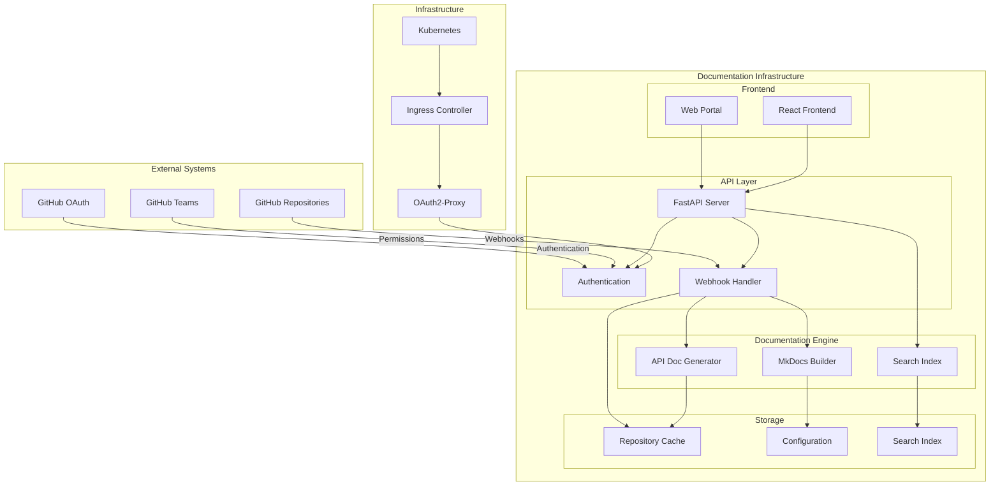
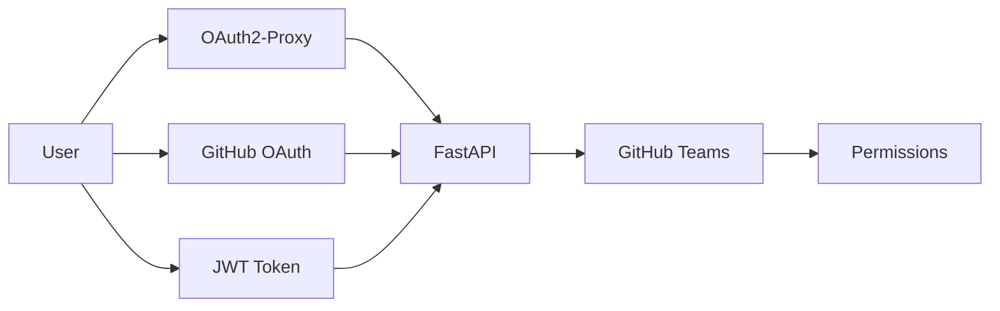
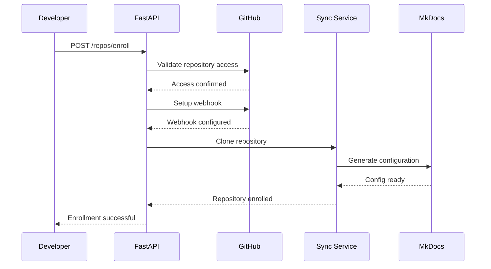
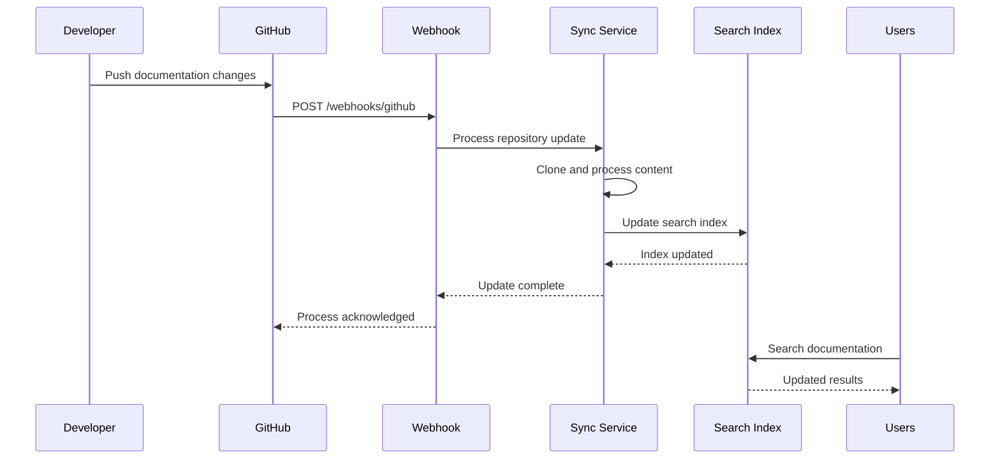
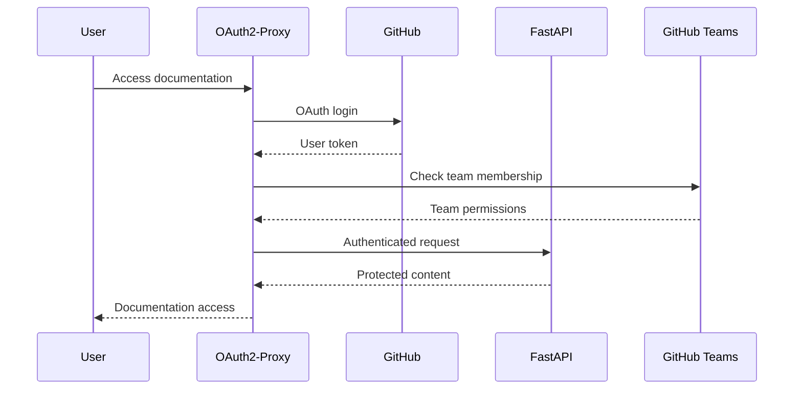

# System Architecture

This document provides a comprehensive overview of the FactFiber Documentation
Infrastructure architecture, design decisions, and system components.

## Overview

The FactFiber Documentation Infrastructure is designed as a distributed,
scalable system that aggregates documentation from multiple repositories into a
unified portal with real-time synchronization and secure access control.

## High-Level Architecture



## System Components

### 1. API Layer (`src/ff_docs/server/`)

The FastAPI-based REST API provides the core interface for repository management, webhooks, and search.

#### **FastAPI Server (`main.py`)**

- **Purpose**: Central API server coordinating all system functionality
- **Responsibilities**:
  - Repository enrollment and management
  - Webhook processing for real-time updates
  - Global search across repositories
  - Authentication and authorization
- **Key Features**:
  - Async/await for high performance
  - Automatic API documentation (OpenAPI/Swagger)
  - Request validation with Pydantic
  - CORS configuration for web clients

#### **Authentication System (`auth/`)**

- **JWT Handler (`jwt_handler.py`)**: Secure token generation and validation
- **GitHub Auth (`github_auth.py`)**: GitHub OAuth integration
- **OAuth2-Proxy Integration (`oauth2_proxy.py`)**: Enterprise authentication
- **Repository Permissions (`repository_permissions.py`)**: Team-based access control

#### **Route Handlers (`routes/`)**

- **Repository Management (`repos.py`)**: CRUD operations for repositories
- **Webhook Processing (`webhooks.py`)**: GitHub webhook handlers
- **Authentication (`auth.py`)**: Login/logout and user management
- **Health Checks (`health.py`)**: System status monitoring

### 2. Documentation Engine (`src/ff_docs/pipeline/`)

Handles documentation processing, aggregation, and generation.

#### **Content Synchronization (`sync.py`)**

- **Repository Cloning**: Automated git operations for content updates
- **Content Processing**: Markdown transformation and validation
- **Link Rewriting**: Transparent URL transformation for unified navigation
- **Conflict Resolution**: Handling concurrent updates and merge conflicts

#### **Configuration Management (`config_generator.py`)**

- **Dynamic MkDocs Config**: Generation of unified documentation configuration
- **Repository Integration**: Seamless integration of multiple documentation sources
- **Theme Consistency**: Unified branding and navigation across projects
- **Plugin Coordination**: Management of MkDocs plugins and extensions

#### **API Documentation (`pdoc_integration.py`)**

- **Automatic Generation**: Python API documentation from docstrings
- **Mathematical Notation**: Support for LaTeX/MathJax in code docs
- **Cross-References**: Linking between manual and generated documentation
- **Version Management**: Handling multiple API versions

### 3. Repository Management (`src/ff_docs/aggregator/`)

Handles discovery, enrollment, and management of documentation repositories.

#### **GitHub Integration (`github_client.py`)**

- **Repository Discovery**: Automated detection of documentation-ready repositories
- **Access Validation**: Verification of repository permissions and team membership
- **Webhook Management**: Automatic webhook setup and configuration
- **Rate Limiting**: GitHub API rate limit management and optimization

#### **Enrollment System (`enrollment.py`)**

- **Repository Onboarding**: Streamlined process for adding new repositories
- **Validation**: Checks for documentation standards compliance
- **Configuration**: Automated setup of repository-specific settings
- **Rollback**: Safe enrollment failure recovery

### 4. Search and Discovery (`src/ff_docs/search/`)

Provides global search functionality across all enrolled repositories.

#### **Security Filtering (`security_filter.py`)**

- **Permission-Based Results**: Search results filtered by user access rights
- **Team Membership**: Integration with GitHub team permissions
- **Repository Scope**: Limiting search scope to accessible repositories
- **Content Sanitization**: Preventing information leakage through search

### 5. Configuration Management (`src/ff_docs/config/`)

Centralized configuration system for all components.

#### **Settings Management (`settings.py`)**

- **Environment Variables**: Comprehensive environment-based configuration
- **Validation**: Pydantic-based configuration validation
- **Default Values**: Sensible defaults for development and production
- **Secret Management**: Secure handling of API keys and tokens

## Design Decisions

### 1. **Multi-Repository Architecture**

**Decision**: Aggregate documentation from multiple repositories rather than centralized docs

**Rationale**:

- **Developer Workflow**: Developers can write documentation alongside code
- **Ownership**: Clear ownership and responsibility for documentation
- **Scalability**: System scales naturally with repository growth
- **Autonomy**: Teams maintain independence while benefiting from unified access

**Trade-offs**:

- **Complexity**: More complex synchronization and consistency challenges
- **Latency**: Network overhead for cross-repository operations
- **Dependencies**: System depends on external repository availability

### 2. **Webhook-Based Synchronization**

**Decision**: Use GitHub webhooks for real-time documentation updates

**Rationale**:

- **Real-time Updates**: Documentation stays current with code changes
- **Efficiency**: Only processes changes when they occur
- **Scalability**: Handles high-frequency updates efficiently
- **Reliability**: GitHub provides reliable webhook delivery

**Implementation**:

```python
@router.post("/webhooks/github")
async def github_webhook(request: Request):
    # Validate webhook signature
    # Process push/PR events
    # Trigger documentation rebuild
    # Update search index
```

### 3. **Authentication Strategy**

**Decision**: Multi-layered authentication with GitHub OAuth and JWT

**Rationale**:

- **Enterprise Integration**: OAuth2-Proxy for enterprise environments
- **Developer Experience**: GitHub OAuth for seamless developer access
- **API Access**: JWT tokens for programmatic access
- **Granular Control**: Team-based permissions for fine-grained access

**Architecture**:



### 4. **Documentation Standards**

**Decision**: Enforce standardized documentation structure across repositories

**Rationale**:

- **Consistency**: Uniform user experience across projects
- **Discoverability**: Predictable navigation and content organization
- **Automation**: Enables automated processing and aggregation
- **Quality**: Ensures minimum documentation quality standards

**Standards**:

- **Directory Structure**: `docs/guide/`, `docs/reference/`, `docs/assets/`
- **Navigation**: Consistent MkDocs navigation patterns
- **API Documentation**: Automated pdoc generation
- **Content Guidelines**: Google-style docstrings and markdown standards

### 5. **Containerized Deployment**

**Decision**: Kubernetes-native deployment with DevSpace for development

**Rationale**:

- **Scalability**: Horizontal scaling for high-traffic scenarios
- **Reliability**: Built-in health checks and self-healing
- **Development Efficiency**: Hot-reloading and rapid iteration
- **Production Parity**: Same environment for development and production

**Components**:

- **Application Pods**: FastAPI servers with auto-scaling
- **OAuth2-Proxy**: Authentication middleware
- **Ingress**: Load balancing and TLS termination
- **Persistent Storage**: Documentation cache and search index

## Data Flow

### 1. **Repository Enrollment Flow**



### 2. **Documentation Update Flow**



### 3. **Authentication Flow**



## Performance Considerations

### 1. **Scaling Strategy**

- **Horizontal Scaling**: Multiple FastAPI instances behind load balancer
- **Caching**: Redis for session management and frequent queries
- **CDN**: Static documentation served via content delivery network
- **Database**: PostgreSQL for persistent state and search metadata

### 2. **Optimization Techniques**

- **Async Processing**: Non-blocking I/O for webhook processing
- **Batch Operations**: Grouping multiple repository updates
- **Incremental Builds**: Only rebuilding changed documentation
- **Search Optimization**: Elasticsearch for complex queries

### 3. **Resource Management**

- **Memory**: Efficient git operations with shallow clones
- **CPU**: Parallel processing for multiple repository updates
- **Storage**: Automated cleanup of old documentation versions
- **Network**: Compression and efficient GitHub API usage

## Security Architecture

### 1. **Authentication Layers**

1. **OAuth2-Proxy**: Enterprise-grade authentication gateway
2. **GitHub OAuth**: Developer-friendly authentication
3. **JWT Tokens**: Stateless API authentication
4. **Team Permissions**: GitHub team-based authorization

### 2. **Security Controls**

- **HTTPS Everywhere**: TLS encryption for all communications
- **Webhook Signatures**: Cryptographic verification of GitHub webhooks
- **Input Validation**: Comprehensive request validation with Pydantic
- **Rate Limiting**: Protection against abuse and DoS attacks

### 3. **Data Protection**

- **Access Control**: Repository-level permissions enforcement
- **Content Sanitization**: Prevention of XSS and injection attacks
- **Audit Logging**: Comprehensive logging of all system operations
- **Secret Management**: Secure storage and rotation of API keys

## Monitoring and Observability

### 1. **Health Monitoring**

- **Health Endpoints**: `/health/` for system status
- **Dependency Checks**: GitHub API, database, and search connectivity
- **Performance Metrics**: Response times and error rates
- **Resource Usage**: CPU, memory, and storage monitoring

### 2. **Logging Strategy**

- **Structured Logging**: JSON format for machine processing
- **Correlation IDs**: Request tracing across system components
- **Error Tracking**: Comprehensive error reporting and alerting
- **Audit Trail**: Security and compliance logging

### 3. **Metrics Collection**

- **Application Metrics**: Custom business metrics via Prometheus
- **Infrastructure Metrics**: Kubernetes cluster monitoring
- **User Analytics**: Documentation usage patterns and trends
- **Performance Profiling**: Detailed performance analysis tools

## Future Architecture Evolution

### 1. **Planned Enhancements**

- **Multi-Cloud**: Support for AWS, GCP, and Azure deployments
- **Edge Caching**: Global content distribution for faster access
- **AI Integration**: Automated documentation quality assessment
- **Real-time Collaboration**: Live editing and review capabilities

### 2. **Scalability Roadmap**

- **Microservices**: Decomposition into specialized services
- **Event Streaming**: Apache Kafka for high-volume event processing
- **Database Sharding**: Horizontal database scaling strategy
- **API Gateway**: Centralized API management and routing

### 3. **Technology Evolution**

- **Python 3.13+**: Leveraging latest language features
- **FastAPI 1.0+**: Staying current with framework evolution
- **Kubernetes 1.30+**: Advanced orchestration capabilities
- **Modern Frontend**: Progressive Web App with offline capabilities

---

This architecture provides a solid foundation for scalable, secure, and
maintainable documentation infrastructure while maintaining flexibility for
future growth and evolution.
