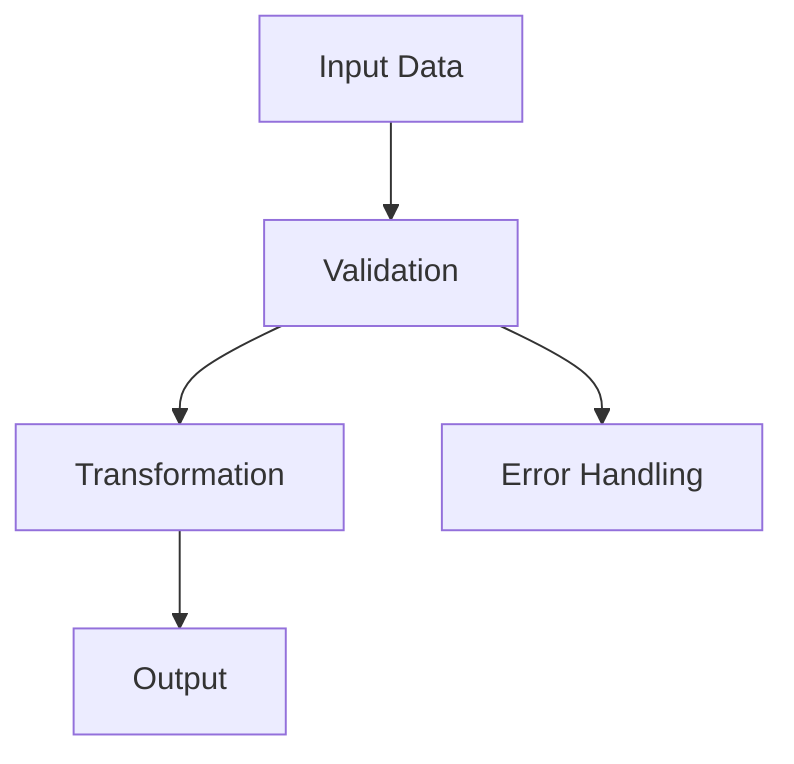

# Documentation Standards Guide

This guide defines the documentation standards for repositories participating
in the FactFiber unified documentation system. Following these standards
ensures consistent, discoverable, and maintainable documentation across all
projects.

## Quick Start Checklist

- [ ] Create standardized directory structure under `docs/`
- [ ] Configure `mkdocs.yml` with required plugins and theme
- [ ] Set up pdoc configuration in `pyproject.toml`
- [ ] Add GitHub Actions workflow for automated documentation builds
- [ ] Follow Google-style docstring standards in code
- [ ] Create required index files with proper navigation

## Directory Structure

### Required Structure

All repositories must follow this standardized documentation layout:

```text
docs/
├── index.md                    # Repository overview and navigation
├── guide/                      # Cross-cutting documentation
│   ├── index.md               # Guide navigation hub
│   ├── getting-started.md     # Installation and setup
│   ├── architecture.md        # System architecture overview
│   ├── development.md         # Development guide
│   └── documentation_standards.md  # This file
├── reference/                  # Technical reference documentation
│   ├── code/                  # Auto-generated code documentation (pdoc)
│   │   └── (pdoc HTML output)
│   └── components/            # Manual component documentation
│       └── {package_name}/    # Mirrors source code structure
│           ├── index.md      # Package overview
│           └── {module}/     # Module-specific docs
└── assets/                    # Images, diagrams, and media
    ├── images/
    └── diagrams/
```

### Directory Purposes

**`docs/index.md`**

- Repository landing page
- High-level overview and purpose
- Navigation to main documentation sections
- Quick links to getting started

**`docs/guide/`**

- Cross-cutting concerns and workflows
- Architecture and design decisions
- Development and contribution guides
- Tutorials and how-to documentation

**`docs/reference/`**

- Technical reference documentation organized by structure
- Contains both auto-generated and manual documentation

**`docs/reference/code/`**

- Auto-generated code documentation from pdoc
- Function signatures and API reference
- Automatically updated from source code

**`docs/reference/components/`**

- Manual component-specific technical documentation
- Mirrors source code package structure
- Detailed technical specifications and implementation details

**`docs/assets/`**

- Images, diagrams, and media files
- Architectural diagrams (Mermaid, PlantUML)
- Screenshots and visual aids

## Configuration Requirements

### MkDocs Configuration (`mkdocs.yml`)

Create a standardized `mkdocs.yml` in your repository root:

```yaml
site_name: "{Repository Name} Documentation"
site_description: "Documentation for {repository description}"
site_url: "https://docs.factfiber.ai/projects/{repo-name}/"

theme:
  name: material
  palette:
    - scheme: default
      primary: blue
      accent: blue
  features:
    - navigation.tabs
    - navigation.sections
    - navigation.expand
    - navigation.top
    - search.highlight
    - search.share
    - content.code.copy
    - content.action.edit

plugins:
  - search:
      separator: '[\s\-,:!=\[\]()"`/]+|\.(?!\d)|&[lg]t;|(?!\b)(?=[A-Z][a-z])'
  - mermaid2:
      arguments:
        theme: default

markdown_extensions:
  - admonition
  - codehilite:
      guess_lang: false
  - toc:
      permalink: true
  - pymdownx.arithmatex:
      generic: true
  - pymdownx.superfences:
      custom_fences:
        - name: mermaid
          class: mermaid
          format: !!python/name:pymdownx.superfences.fence_code_format

extra_javascript:
  - https://polyfill.io/v3/polyfill.min.js?features=es6
  - https://cdn.jsdelivr.net/npm/mathjax@3/es5/tex-mml-chtml.js

nav:
  - Home: index.md
  - Guide:
    - guide/index.md
    - Getting Started: guide/getting-started.md
    - Architecture: guide/architecture.md
    - Development: guide/development.md
    - Documentation Standards: guide/documentation_standards.md
  - Reference:
    - reference/index.md
    # Add package-specific navigation here
  - API Reference: api/index.html

edit_uri: blob/main/docs/
```

### pdoc Configuration (`pyproject.toml`)

Add pdoc configuration to your `pyproject.toml`:

```toml
[tool.poetry.scripts]
docs-api = "bash -c 'pdoc -o docs/api --math --mermaid src/**/*.py'"
docs-serve = "mkdocs serve --dev-addr 0.0.0.0:8000"
docs-build = "mkdocs build"

[tool.pdoc]
# pdoc configuration
output_directory = "docs/api"
include_undocumented = true
show_source = true
math = true
mermaid = true
```

### GitHub Actions Workflow

Create `.github/workflows/docs.yml`:

```yaml
name: Documentation

on:
  push:
    branches: [main, develop]
    paths: ['docs/**', 'src/**', 'mkdocs.yml']
  pull_request:
    branches: [main]
    paths: ['docs/**', 'src/**', 'mkdocs.yml']

jobs:
  build-docs:
    runs-on: ubuntu-latest
    steps:
      - uses: actions/checkout@v3

      - name: Set up Python
        uses: actions/setup-python@v4
        with:
          python-version: '3.11'

      - name: Install Poetry
        uses: snok/install-poetry@v1

      - name: Install dependencies
        run: poetry install

      - name: Generate API documentation
        run: poetry run docs-api

      - name: Build documentation
        run: poetry run docs-build

      - name: Deploy to GitHub Pages
        if: github.ref == 'refs/heads/main'
        uses: peaceiris/actions-gh-pages@v3
        with:
          github_token: ${{ secrets.GITHUB_TOKEN }}
          publish_dir: ./site
```

## Linting and Quality Standards

### Pre-commit Configuration

All repositories must use pre-commit hooks for consistent documentation quality.
Create `.pre-commit-config.yaml` in your repository root:

```yaml
repos:
  - repo: https://github.com/pre-commit/pre-commit-hooks
    rev: v5.0.0
    hooks:
      - id: trailing-whitespace
        exclude: ^docs/reference/code/  # Exclude generated docs
      - id: end-of-file-fixer
        exclude: ^docs/reference/code/
      - id: check-added-large-files
        args: ['--maxkb=1000']  # Allow larger generated docs
        exclude: ^docs/reference/code/

  - repo: https://github.com/Lucas-C/pre-commit-hooks
    rev: v1.5.5
    hooks:
      - id: forbid-tabs
        exclude: ^docs/reference/code/
      - id: remove-tabs
        exclude: ^docs/reference/code/

  - repo: https://github.com/igorshubovych/markdownlint-cli
    rev: v0.45.0
    hooks:
      - id: markdownlint
        args: ['--fix']
        files: \.(md|markdown)$
```

### Markdown Linting Rules

Create `.markdownlint.yaml` for consistent markdown formatting:

```yaml
# Markdownlint configuration
default: true

# MD013 - Line length
MD013:
  line_length: 120
  code_blocks: false    # Don't check code blocks
  tables: false         # Don't check tables
  headings: false       # Don't check headings

# MD024 - Multiple headings with same content
MD024:
  siblings_only: true   # Allow if not siblings

# MD033 - Inline HTML
MD033:
  allowed_elements: [br, p, div, span, a, img, code, pre]
```

### Generated Documentation Exclusions

**Why exclude `docs/reference/code/`?**

- pdoc generates HTML with its own formatting rules
- We don't control tabs, whitespace, or file sizes in generated output
- Manual fixes would be overwritten on regeneration
- Link validation and content checks still apply

**What still gets checked:**

- All manually written markdown files
- YAML configuration files
- Python source code (via ruff, mypy)
- Broken links in generated documentation

## In-Code Documentation Standards

### Google-Style Docstrings

Follow Google-style docstring conventions for all Python code:

```python
def process_data(input_data: List[Dict[str, Any]],
                 threshold: float = 0.5) -> ProcessingResult:
    """
    Process input data with specified threshold.

    This function applies filtering and transformation operations to the input
    data based on the provided threshold value. Results are returned as a
    structured ProcessingResult object.

    Args:
        input_data: List of dictionaries containing raw data to process.
            Each dictionary must contain 'value' and 'timestamp' keys.
        threshold: Minimum value threshold for filtering. Values below this
            threshold will be excluded from processing. Default is 0.5.

    Returns:
        ProcessingResult object containing:
            - processed_items: List of processed data items
            - filtered_count: Number of items filtered out
            - processing_time: Time taken for processing in seconds

    Raises:
        ValueError: If input_data is empty or contains invalid format.
        ProcessingError: If processing fails due to data corruption.

    Example:
        >>> data = [{'value': 0.8, 'timestamp': '2023-01-01'}]
        >>> result = process_data(data, threshold=0.6)
        >>> print(result.processed_items)
        [ProcessedItem(value=0.8, timestamp=datetime(2023, 1, 1))]

    Note:
        This function modifies input data in-place for performance reasons.
        Use copy.deepcopy() if you need to preserve original data.
    """
```

### Class Documentation

```python
class DataProcessor:
    """
    High-performance data processing engine for ML workflows.

    This class provides efficient data transformation and filtering capabilities
    optimized for machine learning pipelines. It supports both batch and
    streaming processing modes.

    Attributes:
        config: Configuration object containing processing parameters.
        cache_size: Maximum number of items to keep in memory cache.
        processing_mode: Either 'batch' or 'streaming' for processing mode.

    Example:
        >>> processor = DataProcessor(config=my_config)
        >>> processor.set_mode('batch')
        >>> results = processor.process(input_data)
    """

    def __init__(self, config: ProcessingConfig) -> None:
        """
        Initialize the data processor with configuration.

        Args:
            config: Configuration object specifying processing parameters,
                including thresholds, filters, and output formats.

        Raises:
            ConfigurationError: If config validation fails.
        """
```

### Module Documentation

Every Python module should start with a module-level docstring:

```python
"""
Data processing utilities for machine learning workflows.

This module provides core data processing functionality including:
- Data validation and cleaning
- Feature extraction and transformation
- Batch and streaming processing capabilities
- Performance-optimized filtering operations

The module is designed for high-throughput ML pipelines and supports
both CPU and GPU acceleration through CUDA when available.

Example:
    Basic usage for batch processing:

    >>> from timbuktu.process import DataProcessor
    >>> processor = DataProcessor(config)
    >>> results = processor.process_batch(data)

Typical usage:
    1. Configure processor with processing parameters
    2. Load and validate input data
    3. Apply transformations and filters
    4. Export results in required format

Note:
    This module requires CUDA 11.8+ for GPU acceleration features.
    CPU fallback is available for all operations.
"""
```

### Type Hints

Use comprehensive type hints for all function signatures:

```python
from typing import List, Dict, Optional, Union, Tuple, Any
from pathlib import Path
import numpy as np
from nptyping import NDArray, Float64

def transform_features(
    features: NDArray[Any, Float64],
    weights: Optional[NDArray[Any, Float64]] = None,
    output_path: Optional[Path] = None
) -> Tuple[NDArray[Any, Float64], Dict[str, Any]]:
    """Transform feature matrix with optional weights."""
```

## Content Guidelines

### Writing Style

- **Clear and Concise**: Use simple, direct language
- **Active Voice**: Prefer active over passive voice
- **Present Tense**: Use present tense for describing functionality
- **Consistent Terminology**: Maintain consistent terminology throughout

### Code Examples

- **Complete Examples**: Provide working, complete code examples
- **Error Handling**: Show proper error handling in examples
- **Real-World Usage**: Use realistic examples, not toy problems
- **Testing**: Include examples of how to test the functionality

### Cross-References

Use consistent linking patterns:

```markdown
<!-- Link to other documentation -->
See the [Architecture Guide](architecture.md) for system overview.

<!-- Link to API documentation -->
For details, see [`process_data()`](../api/timbuktu/process.html#process_data).

<!-- Link to external resources -->
Based on [Google's Python Style Guide](https://google.github.io/styleguide/pyguide.html).
```

### Mathematical Notation

Use MathJax for mathematical expressions:

```markdown
The loss function is defined as:

$$L(\theta) = \frac{1}{n} \sum_{i=1}^{n} \ell(y_i, f_\theta(x_i))$$

For inline math, use $\alpha = 0.01$ for the learning rate.
```

### Diagrams

Use Mermaid for architectural and flow diagrams:

```markdown


## Integration with Documentation Portal

### Repository Registration

To integrate with the central documentation portal:

1. **Webhook Configuration**: Set up GitHub webhook for real-time updates
2. **Repository Enrollment**: Register repository through portal API
3. **Access Permissions**: Configure team-based access control
4. **Navigation Integration**: Ensure proper navigation structure

### Link Rewriting

The portal automatically rewrites relative links for unified navigation:

- **Local Links**: `[Setup Guide](../guide/setup.md)`
- **Portal Links**: `/projects/your-repo/guide/setup/` (automatically converted)

### Search Integration

Documentation is automatically indexed for global search:

- **Content Indexing**: All markdown content is searchable
- **API Search**: Generated API docs are included in search
- **Filtered Results**: Search results respect repository access permissions

## Quality Assurance

### Documentation Review

Include documentation in your code review process:

- **Content Accuracy**: Verify technical accuracy
- **Link Validation**: Check all internal and external links
- **Code Examples**: Test all code examples
- **Navigation**: Verify navigation structure works

### Automated Validation

Set up automated checks:

```yaml
# In .github/workflows/docs.yml
- name: Validate documentation
  run: |
    poetry run mkdocs build --strict
    find docs -name "*.md" -exec markdown-link-check {} \;
```

### Documentation Metrics

Track documentation health:

- **Coverage**: Ensure all public APIs are documented
- **Freshness**: Keep documentation synchronized with code changes
- **Usage**: Monitor which documentation sections are accessed
- **Feedback**: Collect user feedback on documentation quality

## Migration Guide

### From Existing Documentation

If you have existing documentation:

1. **Audit Current Structure**: Identify what content exists
2. **Map to New Structure**: Plan migration to standardized layout
3. **Update Links**: Fix internal links and references
4. **Test Integration**: Verify portal integration works
5. **Update Tooling**: Migrate to standardized build process

### Gradual Migration

You can migrate incrementally:

1. **Start with Structure**: Create directory structure first
2. **Move Content**: Migrate content section by section
3. **Update Configuration**: Implement standardized configs
4. **Add Automation**: Set up CI/CD for documentation builds

## Support and Resources

### Getting Help

- **Documentation Portal**: [https://docs.factfiber.ai](https://docs.factfiber.ai)
- **Developer Guide**: [Development Documentation](../dev/getting-started.md)
- **Style Guides**: [Google Python Style Guide](https://google.github.io/styleguide/pyguide.html)

### Templates and Examples

- **Template Repository**: Use timbuktu as reference implementation
- **Configuration Templates**: Available in portal repository
- **Example Workflows**: GitHub Actions templates provided

---

Following these standards ensures your repository documentation integrates
seamlessly with the FactFiber documentation portal while maintaining high
quality and consistency across all projects.
